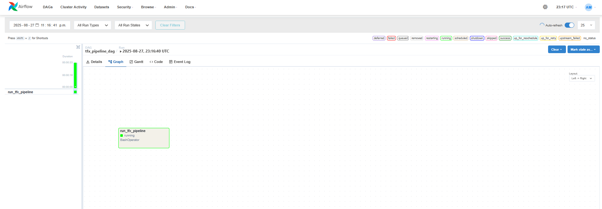
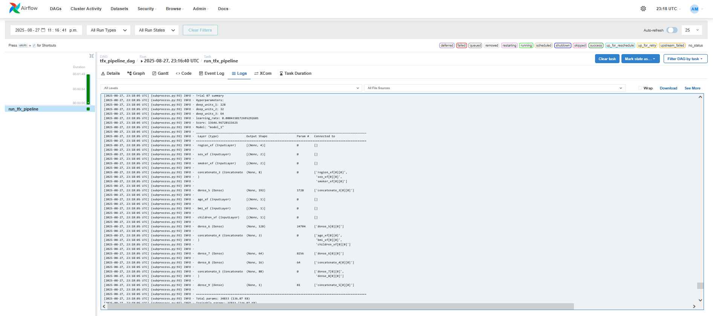
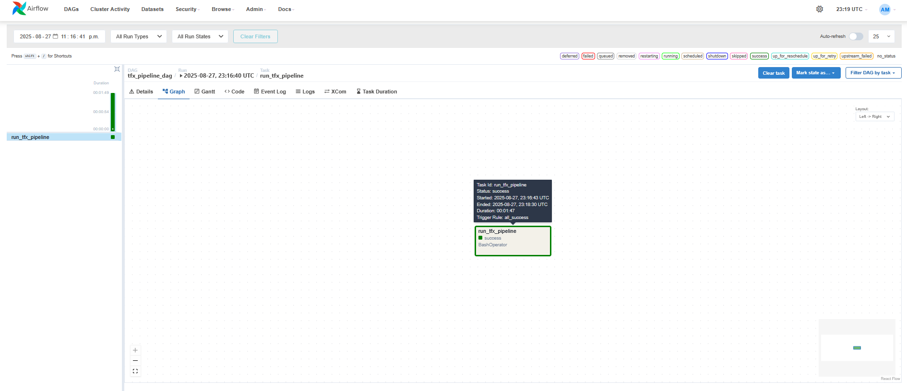

  

# 📌 AirflowTFX: Reproducible ML Pipeline Orchestration with TensorFlow Extended (TFX)
> End-to-end machine learning pipeline built with TFX and orchestrated via Apache Airflow, demonstrating automated, reproducible ML workflows using a real-world dataset.

## 📖 Overview
 - This project implements a **TFX-based ML pipeline** for **medical insurance cost prediction**, orchestrated with Apache Airflow to enable automated and repeatable workflows.
- Unlike the original reference implementation from "Building Machine Learning Pipelines" (Hapke & Nelson, 2020), this version uses a **custom dataset** and tailored preprocessing, feature engineering, and evaluation steps to showcase applied MLOps skills.
 - The pipeline was developed in a **local Airflow environment** (non-containerized), focusing on **pipeline modularity and automation**.
 - Due to compatibility issues between Airflow and TFX installations, the TFX pipeline was created separately. A dedicated virtual environment was then invoked from within Airflow to execute the compiled pipeline file, as defined in the `TFX_Pipeline_DAG.py` script.

## 🏢 Business Impact
This project demonstrates how **structured, automated pipelines** can streamline model development, reduce manual intervention, and increase **traceability and reproducibility**—critical steps toward production-ready ML infrastructure in real-world scenarios.

## 🚀 Features
✅ **End-to-End Workflow:** Covers data ingestion, schema validation, transformation, training, and evaluation in one orchestrated pipeline.  
✅ **Custom Dataset Integration:** Adapted pipeline components for real-world medical cost data.  
✅ **Airflow Orchestration:** DAG-based execution, logging, and task dependency management for reproducible runs.  
✅ **TFX Ecosystem:** Leveraged TFDV, TFT, and TFMA for scalable, standardized ML operations.  

## ⚙️ Tech Stack
| Technology                  | Purpose                                           |
| --------------------------- | ------------------------------------------------- |
| `Python`                    | Core programming language                         |
| `TensorFlow Extended (TFX)` | Standardized ML pipeline framework                |
| `Apache Airflow`            | Workflow orchestration and task scheduling        |
| `TF Data Validation (TFDV)` | Detect anomalies and infer schema                 |
| `TF Transform (TFT)`        | Consistent preprocessing for training and serving |
| `TF Model Analysis (TFMA)`  | Post-training model evaluation                    |
| `pandas`                    | Data manipulation and feature engineering         |

## 📂 Project Structure
<pre>
📦 AirflowTFX - Reproducible ML Pipeline Orchestration with TensorFlow Extended (TFX)
 ┣ 📂 Airflow
 ┣ 📂 data
 ┣ 📂 imgs
 ┣ 📜 base_pipeline.py
 ┣ 📜 module.py
 ┣ 📜 pipeline_run.py
 ┗ README.md
</pre>

## 🛠️ Installation
1️⃣ **Clone the Repository**
<pre>
git clone https://github.com/ahmedmoussa/Projects-Portfolio.git
cd 'AirflowTFX - Reproducible ML Pipeline Orchestration with TensorFlow Extended (TFX)'
</pre>

2️⃣ **Setup Airflow Environment**
<pre>
source airflow_venv/bin/activate                            # Path to virtual environment where you installed airflow

export AIRFLOW_HOME=~/airflow
mkdir -p "$AIRFLOW_HOME/dags" "$AIRFLOW_HOME/logs"          # Create `dags` and `logs` folders

airflow db init                                             # Initialize airflow db

airflow scheduler                                           # Run airflow scheduler (in terminal 1)

airflow webserver --port 8080                               # Run airflow webserver (in terminal 2)
</pre>

3️⃣ **Trigger Pipeline DAG**
<pre>
airflow dags trigger tfx_pipeline_dag
</pre>

## 📂 Pipeline Runs
### Pipeline DAG (compiled TFX pipeline in Airflow UI)

  

### Pipeline Run Log (sample)

  

### Successful Pipeline Run

  

## 📊 Results
- **Prediction Task:** Regression model for medical insurance cost prediction.
- **Pipeline successfully automated** data ingestion, schema validation, transformation, training, and evaluation.
- **Improved reproducibility and scalability** compared to manual, notebook-based workflows.

## 📝 License
This project is shared for portfolio purposes only and may not be used for commercial purposes without permission.