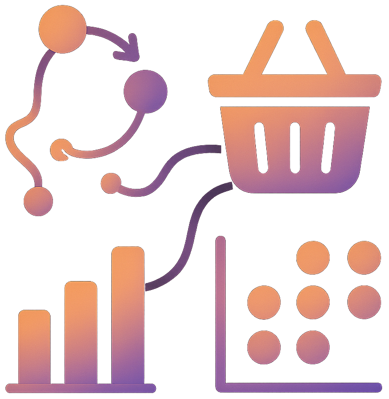

  

# 📌 Association Rule Mining: Market Basket Insights
> A retail analytics project applying association rule mining to uncover hidden product co-purchasing patterns, enabling smarter cross-selling, bundling, and promotion strategies.

## 📖 Overview
- This project applies **unsupervised learning** techniques to discover relationships between products purchased together.
- By leveraging **Apriori** and **association rule mining**, it generates interpretable rules (support, confidence, lift) that provide insights into **customer buying behavior**.  

## 🏢 Business Impact
Association Rule Mining empowers retailers to **optimize product placement, bundling, and promotions** by identifying hidden customer purchasing patterns. This leads to increased sales, higher customer satisfaction, and more effective marketing strategies.

## 🚀 Features
✅ **Market Basket Analysis**: Extracts frequent itemsets and co-occurrence patterns.  
✅ **Rule Mining**: Generates rules with support, confidence, and lift metrics.  
✅ **Actionable Insights**: Identifies product bundles for cross-selling.  
✅ **Reproducible Notebook**: End-to-end workflow in a single Jupyter notebook.  

## ⚙️ Tech Stack
| Technology     | Purpose                              |
| -------------- | ------------------------------------ |
| `pandas`       | Data preprocessing & transformation  |
| `mlxtend`      | Apriori algorithm & rule mining      |
| `matplotlib`   | Data visualization                   |

## 📂 Project Structure
<pre>
📦 Association Rule Mining
 ┣ 📂 imgs
 ┣ 📜 Association_Rule_Mining.ipynb     # Main notebook (data preprocessing, Apriori, rules, visualizations)
 ┗ README.md
</pre>

## 🛠️ Installation
1️⃣ **Clone the Repository**
<pre>
git clone https://github.com/ahmedmoussa/Association-Rule-Mining.git
cd 'Association Rule Mining - Market Basket Insights'
</pre>

2️⃣ **Create Virtual Environment**
<pre>
python -m venv venv
source venv/bin/activate
</pre>

3️⃣ **Launch Jupyter Notebook**
<pre>
jupyter notebook Association_Rule_Mining.ipynb
</pre>

## 📊 Results
- Discovered frequent product co-occurrence patterns.  
- Generated rules with high lift for strong product associations.  
- Produced interpretable visualizations (graphs & heatmaps).  

## 📝 License
This project is shared for portfolio purposes only and may not be used for commercial purposes without permission.