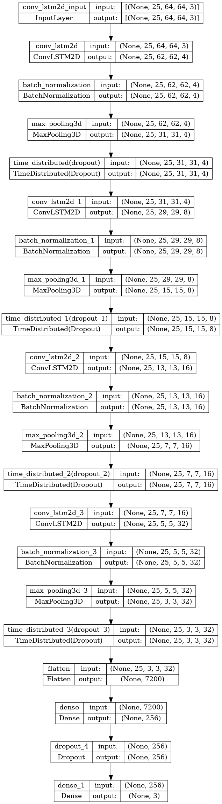

  

# 📌 DeepVision: Video Analysis
> A deep learning solution for automated video content analysis using a ConvLSTM-based classification model.

## 📖 Overview
 - This project implements a **ConvLSTM-based video classification model** to analyze sequential video frames and predict target labels.
 - The architecture combines **convolutional layers** for spatial feature extraction and LSTM units to capture temporal patterns across frames.
 - The solution was developed and evaluated in a **Jupyter Notebook environment**, showcasing a complete ML pipeline from preprocessing to model training and testing *(Note: This version does not include containerization or production deployment)*.

## 🏢 Business Impact
Demonstrates the potential of AI-powered video analysis to **automate complex video review processes**, enabling applications such as **real-time quality inspection, security anomaly detection, and automated video tagging**, reducing manual review time and increasing insight accuracy.

## 🚀 Features
✅ **ConvLSTM Architecture:** Combines CNN and LSTM layers for superior video sequence modeling.  
✅ **Automated Frame Processing:** OpenCV pipeline for frame extraction, resizing, and normalization.  
✅ **End-to-End ML Workflow:** Covers data preprocessing, training, evaluation, and predictions for unseen video data.  
✅ **Reproducible Notebook Implementation:** Allows step-by-step review and experimentation.  

## ⚙️ Tech Stack
| Technology   | Purpose                                  |
| ------------ | ---------------------------------------- |
| `Python`     | Core programming language                |
| `TensorFlow` | Model development and training           |
| `OpenCV`     | Video frame extraction and preprocessing |
| `CNN`        | Spatial feature extraction               |
| `LSTM`       | Temporal sequence modeling               |
| `NumPy`      | Data handling and manipulation           |

## 🧠 Model Architecture

## 📂 Project Structure
<pre>
📦 DeepVision - Video Analysis 
 ┣ 📂 models         
 ┣ 📂 notebooks
 ┣ 📂 imgs
 ┣ README.md
 ┗ Requirements.txt
</pre>

## 🛠️ Installation
1️⃣ **Clone the Repository**
<pre>
git clone https://github.com/ahmedmoussa/Projects-Portfolio.git
cd 'DeepVision - Video Analysis'
</pre>

2️⃣ **Create Virtual Environment & Install Dependencies**
<pre>
python -m venv venv
source venv/bin/activate
pip install -r requirements.txt
</pre>

▶️ **Run the Notebook**
<pre>
jupyter notebook notebooks/deepvision_convlstm.ipynb
</pre>

## 📊 Results
   - **Model Accuracy:** 84%
   - **Key Metrics:** Precision=85%, Recall=84%, AUC=97%

## 📝 License
This project is shared for portfolio purposes only and may not be used for commercial purposes without permission.