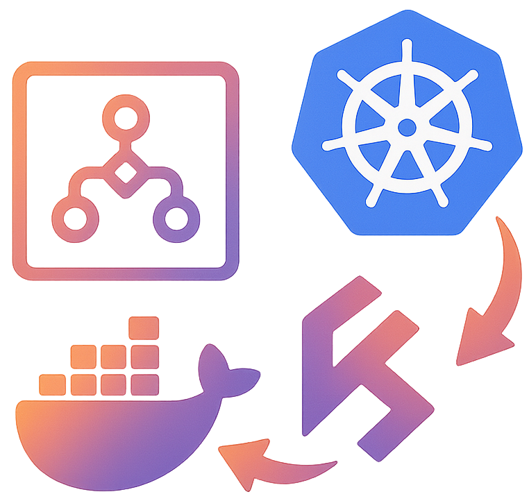
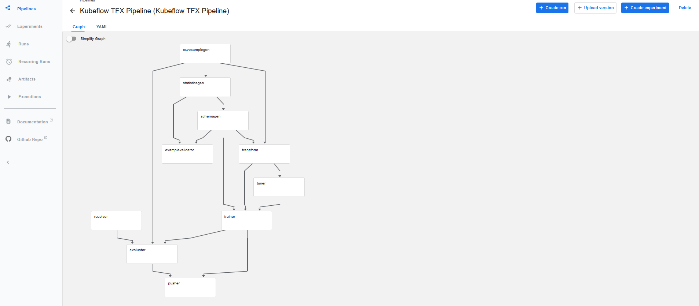
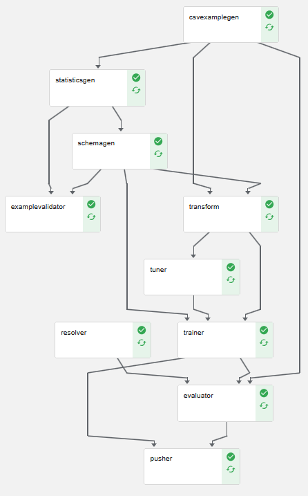
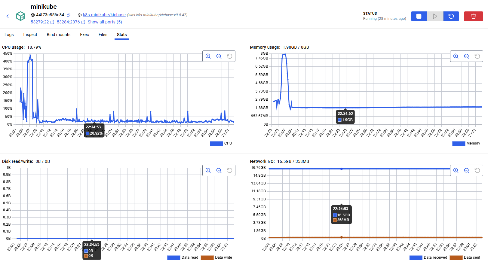
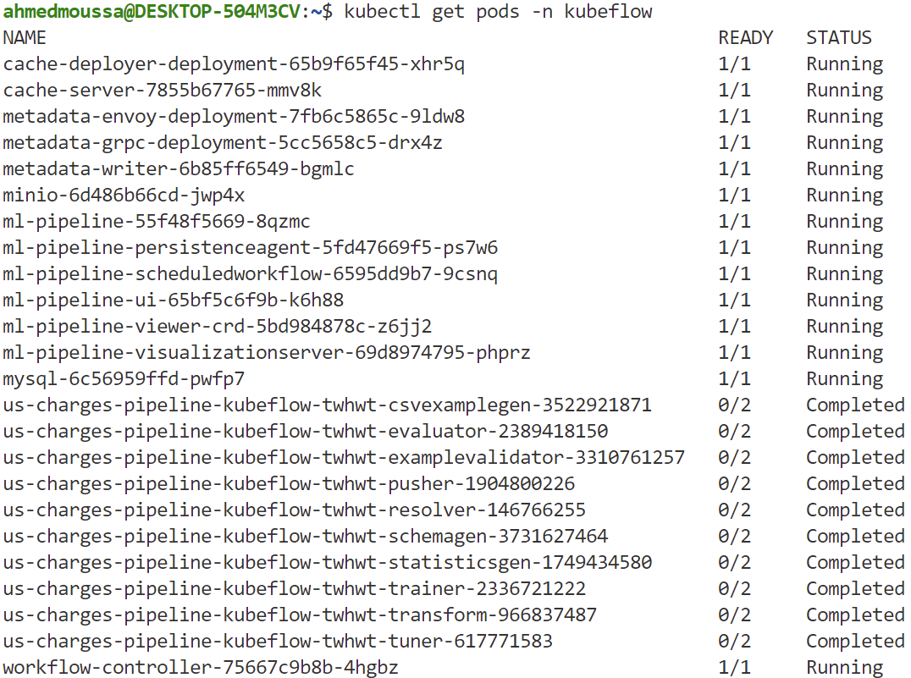

<p align="center">
  
</p>

# 📌 KubeTFX: Scalable ML Pipeline Orchestration with TensorFlow Extended and Kubeflow
> End-to-end machine learning pipeline built with TFX and orchestrated via Kubeflow Pipelines on a local Minikube Kubernetes cluster, demonstrating cloud-native, scalable ML workflows.


## 📖 Overview
- This project implements a **TFX-based ML pipeline** for **medical insurance cost prediction**, orchestrated with **Kubeflow Pipelines** on **Minikube** to simulate production-ready, cloud-native ML workflows.
- Adapted from "Building Machine Learning Pipelines" (Hapke & Nelson, 2020), this version features a **custom dataset** and tailored pipeline components, containerized with Docker for reproducibility.
- Focused on **scalable orchestration, Kubernetes-native execution, and infrastructure-as-code practices** to bridge local development and cloud deployment readiness.


## 🏢 Business Impact
This project demonstrates how Kubernetes-based orchestration improves **scalability, reproducibility, and deployment readiness** in machine learning pipelines, accelerating the path from development to production while ensuring reliable, auditable workflows.


## 🚀 Features
✅ **End-to-End Orchestration:** Automates ingestion, schema validation, data transformation, model training, and evaluation under Kubeflow Pipelines.  
✅ **Kubernetes-Native Execution:** Uses Minikube for local testing of scalable, cloud-compatible workflows.  
✅ **Modular and Portable Design:** Dockerized components with YAML-based configuration for seamless reuse and portability.  
✅ **TFX Ecosystem Integration:** Leverages TFDV, TFT, and TFMA for data validation, transformation, and model analysis.  


## ⚙️ Tech Stack
| Technology                  | Purpose                                                            |
| --------------------------- | ------------------------------------------------------------------ |
| `TensorFlow Extended (TFX)` | Standardized ML pipeline framework                                 |
| `Kubeflow Pipelines`        | Orchestrates pipeline execution and task scheduling                |
| `Minikube`                  | Local Kubernetes cluster simulation                                |
| `Docker`                    | Encapsulates dependencies and ensures environment reproducibility  |
| `TF Data Validation (TFDV)` | Detects anomalies and infers schema from training data             |
| `TF Transform (TFT)`        | Applies consistent preprocessing for training and serving          |
| `TF Model Analysis (TFMA)`  | Evaluates model performance using configurable metrics and slicing |
| `SQLite`                    | Stores pipeline metadata for reproducibility and traceability      |


## 📂 Project Structure
<pre>
📦 KubeTFX - Scalable ML Pipeline Orchestration with TensorFlow Extended and Kubeflow
 ┣ 📂 pl_comps                # Custom pipeline components (TFX modules) 
 ┣ 📂 pl_yaml_output          # Compiled Kubeflow pipeline YAML outputs 
 ┣ 📂 imgs
 ┣ 📜 base_pipeline.py        # Core pipeline definition (TFX DAG) 
 ┣ 📜 pipeline_run.py         # Script to compile & submit pipeline to Kubeflow
 ┣ 📜 pv.yaml                 # Persistent Volume definition for Minikube
 ┣ 📜 pvc.yaml                # Persistent Volume Claim for data storage
 ┗ README.md
</pre>


## 🛠️ Installation
1️⃣ **Clone the Repository**
<pre>
git clone https://github.com/ahmedmoussa/Projects-Portfolio.git
cd 'KubeTFX - Scalable ML Pipeline Orchestration with TensorFlow Extended and Kubeflow'
</pre>

2️⃣ **Activate the Kubeflow Environment**
<pre>
source kf_env/bin/activate
</pre>

3️⃣ **Compile and submit Pipeline**
<pre>
python pipeline_run.py
</pre>
- The compiled YAML will be saved under `pl_yaml_output/` and submitted to the Kubeflow Pipelines UI.


## 🧭 Run Steps (Minikube + Kubeflow Pipelines)

The following commands reproduce my local run on **Minikube with Kubeflow Pipelines**.

### [1] Install `kubectl`, `kustomize`, and `minikube`

### [2] Check Docker
```bash
# Docker reachable?
docker ps                                               

# What does kubectl point to?
kubectl config current-context                          
kubectl cluster-info
```

### [3] Make Sure Minikube is Running
```bash
# Nuke any broken cluster
minikube delete --all --purge

# Fresh start with enough resources (Docker driver in WSL)
minikube start --driver=docker --cpus=4 --memory=8192   

# Ensure kubectl is pointing to the new cluster
kubectl config use-context minikube                     
minikube update-context

# Verify node & API
kubectl get nodes                                       
kubectl cluster-info
```

### [4] Install Kubeflow Pipelines (Standalone)
```bash
export PIPELINE_VERSION=2.14.0

# (1) Cluster-scoped resources
kubectl apply -k "github.com/kubeflow/pipelines/manifests/kustomize/cluster-scoped-resources?ref=$PIPELINE_VERSION"

# (2) Namespace-scoped resources
kubectl apply -k "github.com/kubeflow/pipelines/manifests/kustomize/env/platform-agnostic?ref=$PIPELINE_VERSION"

# (Alt dev env)
# kubectl apply -k "github.com/kubeflow/pipelines/manifests/kustomize/env/dev?ref=$PIPELINE_VERSION"
```

### [5] Wait for Pods to be Ready
```bash
kubectl get pods -n kubeflow -w
```

### [6] Create the PV + PVC
```bash
# Apply PV mounting
kubectl apply -f pv.yaml
kubectl apply -f pvc.yaml

# Check PV mounting
kubectl get pv tfx-pv
kubectl -n kubeflow get pvc tfx-pvc
```

### [7] Access the Kubeflow Pipelines UI
```bash
kubectl port-forward -n kubeflow svc/ml-pipeline-ui 8080:80
```

### [8] Copy Files to the Minikube Running Container
```bash
# Create the folder inside Minikube container - Should match the path specified in the `PV.yaml` and `tfx_pipeline_kubeflow.yaml` files.
minikube ssh -- 'sudo mkdir -p /home/ahmedmoussa/kf_tfx/pl_comps && sudo chown -R docker:docker /home/ahmedmoussa'

# Copy the Files
docker cp /home/ahmedmoussa/kf_tfx/pl_comps/. \                     # Location of pipeline files on your system as in the `pl_comps` folder
  minikube:/home/ahmedmoussa/kf_tfx/pl_comps/                       # Location of pipelines files inside the Minikube container
```

## 📷 Pipeline Runs

### Pipeline Graph (compiled TFX pipeline in KFP UI)

  

### Successful Run (all components green)

  

### Minikube Resource Stats during Run

  

### Pods State in `kubeflow` Namespace

  


## 📊 Results
- **Prediction Task:** Regression model for medical insurance cost prediction.
- **Containerized, Portable Pipeline:** Validated on local Kubernetes cluster.
- **Cloud-ready Orchestration:** Demonstrated scalable, reproducible ML workflow management for real-world deployment scenarios.


## 📝 License
This project is shared for portfolio purposes only and may not be used for commercial purposes without permission.