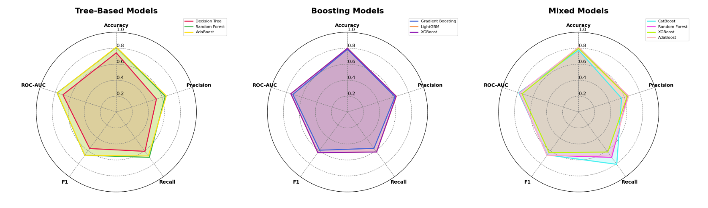

  

# 📌 OptiTree: Benchmarking Tree-Based Models with Metaheuristic Optimization
> A high-performance framework for benchmarking and optimizing tree-based machine learning models using Particle Swarm Optimization (PSO), enabling efficient hyperparameter tuning and experiment tracking for structured classification tasks.

## 📖 Overview
- This project implements a **model benchmarking and optimization suite** for tree-based classifiers, comparing the performance of multiple algorithms under automated hyperparameter search.
- Instead of traditional grid or random search, this pipeline leverages **Particle Swarm Optimization (PSO)** via the custom hyperparameter-optimizer library for **faster convergence and improved model accuracy**.
- Experiment tracking is handled by **MLflow**, while trained models are persisted with **joblib** for reproducibility.

## 🏢 Business Impact
OptiTree provides organizations with a **scalable, automated framework for selecting and tuning tree-based models**, resulting in **higher predictive accuracy, reduced manual effort, and faster iteration cycles** for decision-critical applications such as finance, healthcare, and risk management.

## 🚀 Features
✅ **Multi-Model Benchmarking:** Supports Decision Trees, Random Forests, AdaBoost, Gradient Boosting, LightGBM, XGBoost, and CatBoost classifiers.  
✅ **Automated Hyperparameter Optimization:** Uses PSO for efficient search across complex hyperparameter spaces.  
✅ **Experiment Tracking:** Logs performance metrics, parameters, and artifacts with MLflow.  
✅ **Model Serialization:** Stores best-performing models for later use and deployment.  
✅ **Reproducible Experiments:** Ensures consistent benchmarking and fair comparison across runs.  

## ⚙️ Tech Stack
| Technology                 | Purpose                                                              |
| -------------------------- | -------------------------------------------------------------------- |
| `scikit-learn`             | Provides Decision Trees, Random Forests, AdaBoost, Gradient Boosting |
| `LightGBM`                 | Gradient boosting with optimized performance                         |
| `XGBoost`                  | Extreme gradient boosting                                            |
| `CatBoost`                 | Gradient boosting with categorical feature support                   |
| `hyperparameter-optimizer` | Custom library for PSO-based hyperparameter search                   |
| `MLflow`                   | Experiment tracking and model management                             |
| `joblib`                   | Model serialization and versioning                                   |
| `pandas`                   | Data preprocessing & transformation                                  |

## Models Performance Summary

## 📂 Project Structure
<pre>
📦 OptiTree - Benchmarking Tree-Based Models with Metaheuristic Optimization
 ┣ 📂imgs
 ┣ 📜 OptiTree - Benchmarking Tree-Based Models with Metaheuristic Optimization.ipynb    # Main notebook (data preprocessing, training, optimization, results)
 ┣ 📜 models_comparison.png
 ┣ requirements.txt
 ┗ README.md
</pre>

## 🛠️ Installation
1️⃣ **Clone the Repository**
<pre>
git clone https://github.com/ahmedmoussa/Projects-Portfolio.git
cd 'OptiTree - Benchmarking Tree-Based Models with Metaheuristic Optimization'
</pre>

2️⃣ **Create Virtual Environment & Install Requirements**
<pre>
python -m venv venv
source venv/bin/activate
pip install -r requirements.txt

</pre>

3️⃣ **Launch Jupyter Notebook**
<pre>
jupyter notebook 'OptiTree - Benchmarking Tree-Based Models with Metaheuristic Optimization.ipynb'
</pre>

## 📊 Results
- Benchmarked multiple tree-based models with PSO-tuned hyperparameters.
- Identified top-performing model(s) with improved accuracy compared to default parameters.
- MLflow logged all experiments for reproducibility and comparison.
- Best model serialized for downstream use.

## 📝 License
This project is shared for portfolio purposes only and may not be used for commercial purposes without permission.