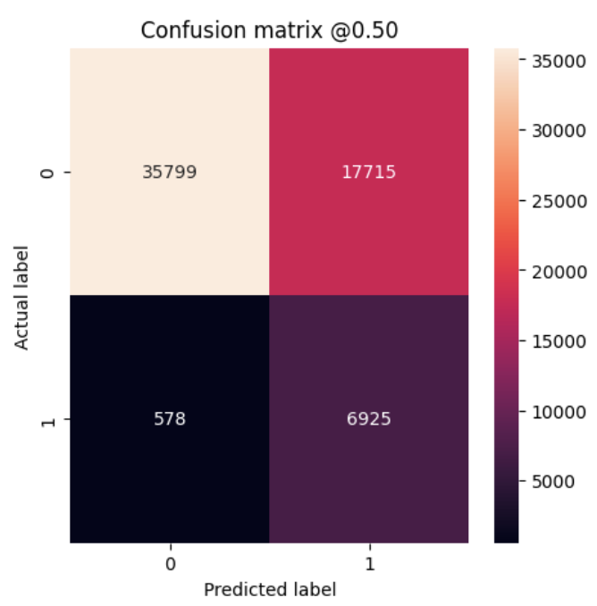
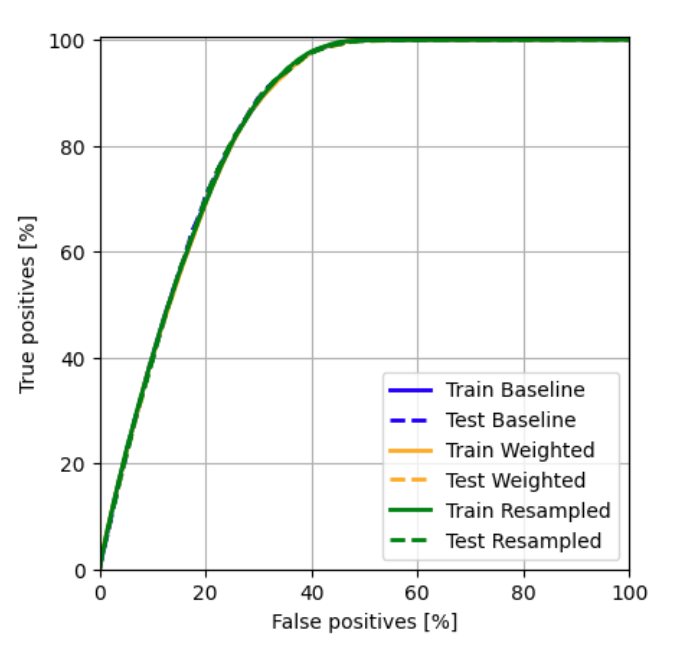

# 📌 PolicyPredict: Insurance Purchase Prediction with Deep Learning
> End-to-end machine learning solution leveraging a fully connected neural network to predict customer likelihood of purchasing new insurance policies, improving marketing strategies and customer engagement.

## 📖 Overview
- This project implements a **data-driven pipeline** to predict customer purchase intent for insurance products.
- The solution uses **deep learning techniques** to process customer data, engineer relevant features, and predict purchase probabilities.
- The workflow includes **data preprocessing, model development, training, evaluation, and visualization**, enabling actionable insights for targeted marketing campaigns.

## 🏢 Business Impact
PolicyPredict equips insurers with a **predictive framework to anticipate customer behavior**, enabling **data-driven targeting, improved marketing ROI, and enhanced customer experience** through timely and personalized policy recommendations.

## 🚀 Features
✅ **End-to-End Workflow:** Covers dataset preparation, feature engineering, model training, evaluation, and reporting.  
✅ **Neural Network Architecture:** Built with TensorFlow for improved predictive power over classical models.  
✅ **Integrated Pipeline:** Combined scikit-learn utilities with TensorFlow for seamless preprocessing and training.  
✅ **Interactive Visualizations:** Used matplotlib and seaborn to provide stakeholders with interpretable insights into customer behavior.  
✅ **Actionable Predictions:** Outputs purchase likelihood scores to support personalized marketing campaigns.  

## ⚙️ Tech Stack
| Technology     | Purpose                                                 |
| -------------- | ------------------------------------------------------- |
| `Python`       | Core programming language                               |
| `TensorFlow`   | Neural network model development                        |
| `scikit-learn` | Data preprocessing, feature engineering, pipeline setup |
| `NumPy`        | High-performance numerical computations                 |
| `pandas`       | Data cleaning, transformation, and analysis             |
| `matplotlib`   | Data visualization and plotting                         |
| `seaborn`      | Statistical and distribution-based visualizations       |

## 📂 Project Structure
<pre>
📦 PolicyPredict - Insurance Purchase Prediction with Deep Learning
 ┣ 📂 imgs
 ┣ 📜 PolicyPredict - Insurance Purchase Prediction with Deep Learning.ipynb    # Main notebook (data preprocessing, model training, evaluation)
 ┣ requirements.txt
 ┗ README.md
</pre>

## 📊 Curves
### Confusion Matrix
    

### ROC Curve
    

## 🛠️ Installation
1️⃣ **Clone the Repository**
<pre>
git clone https://github.com/ahmedmoussa/Projects-Portfolio.git
cd 'PolicyPredict - Insurance Purchase Prediction with Deep Learning'
</pre>

2️⃣ **Create Virtual Environment & Install Requirements**
<pre>
python -m venv venv
source venv/bin/activate
pip install -r requirements.txt
</pre>

3️⃣ **Launch Jupyter Notebook**
<pre>
jupyter notebook 'PolicyPredict - Insurance Purchase Prediction with Deep Learning.ipynb'
</pre>

## 📊 Results
- Trained a deep learning model that successfully predicted customer purchase intent with 70% accuracy and 85% ROC-AUC.
- Generated visual insights into influential features and customer behavior patterns.
- Delivered a **scalable, reusable pipeline** for future policy recommendation use cases.

## 📝 License
This project is shared for portfolio purposes only and may not be used for commercial purposes without permission.