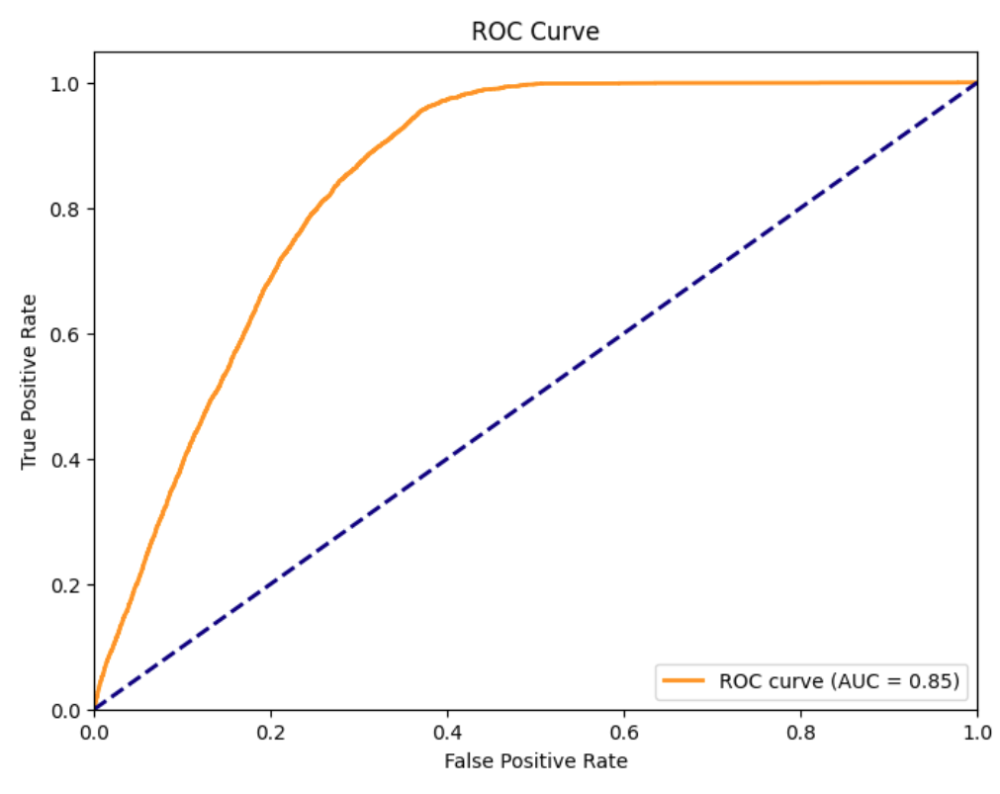

  

# 📌 PolicyPredict Lite: Insurance Purchase Modeling with Classical ML Algorithms
> Lightweight machine learning solution leveraging classical models to predict customer purchase behavior for insurance policies, providing fast and interpretable insights to support marketing and sales strategies.

## 📖 Overview
- This project implements a **scikit-learn-based machine learning pipeline** to predict whether customers are likely to purchase additional insurance products.
- The solution emphasizes **simplicity, interpretability, and efficiency**, avoiding the computational overhead of deep learning models.
- It integrates **data preprocessing, feature selection, multiple model training, and performance evaluation**, enabling rapid experimentation and actionable business insights.

## 🏢 Business Impact
PolicyPredict Lite empowers insurers with a **fast, interpretable, and cost-efficient predictive modeling framework**, allowing them to **prioritize leads, optimize cross-selling strategies, and improve customer outreach** without needing deep learning infrastructure.

## 🚀 Features
✅ **Multiple Model Evaluation:** Logistic Regression, Random Forest, and SVM compared within the same pipeline.  
✅ **End-to-End ML Workflow:** From raw dataset to processed features, trained models, and evaluated performance metrics.  
✅ **Interpretable Insights:** Feature importance and coefficients allow business teams to understand key drivers of customer purchases.  
✅ **Lightweight Deployment:** No specialized infrastructure required; can be run on any machine with Python installed.  

## ⚙️ Tech Stack
| Technology     | Purpose                                                                           |
| -------------- | --------------------------------------------------------------------------------- |
| `Python`       | Core programming language                                                         |
| `scikit-learn` | Data preprocessing, classical ML models (Logistic Regression, Random Forest, SVM) |
| `pandas`       | Data cleaning, transformation, and analysis                                       |
| `NumPy`        | Efficient numerical computations                                                  |

## 📂 Project Structure
<pre>
📦 PolicyPredict Lite - Insurance Purchase Modeling with Classical ML Algorithms
 ┣ 📜 PolicyPredict Lite - Insurance Purchase Modeling with Classical ML Algorithms.ipynb    # Main notebook (data preprocessing, model training, evaluation)
 ┣ 📂 imgs
 ┣ requirements.txt
 ┗ README.md
</pre>

## 🚀 ROC Curves
### Logistic Regression
  

### Random Forests
  

## 🛠️ Installation
1️⃣ **Clone the Repository**
<pre>
git clone https://github.com/ahmedmoussa/Projects-Portfolio.git
cd 'PolicyPredict Lite - Insurance Purchase Modeling with Classical ML Algorithms'
</pre>

2️⃣ **Create Virtual Environment & Install Requirements**
<pre>
python -m venv venv
source venv/bin/activate
pip install -r requirements.txt
</pre>

3️⃣ **Launch Jupyter Notebook**
<pre>
jupyter notebook 'PolicyPredict Lite - Insurance Purchase Modeling with Classical ML Algorithms.ipynb'
</pre>

## 📊 Results
- Achieved accurate predictions on customer purchase behavior using classical ML techniques.
- Delivered **interpretable results**, highlighting key features that drive insurance policy purchases.
- Provided a **lightweight, reusable pipeline** for small-scale deployments and fast experimentation.

## 📝 License
This project is shared for portfolio purposes only and may not be used for commercial purposes without permission.