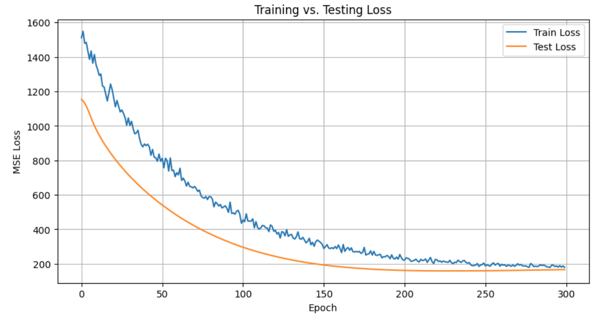

  

# 📌 Product Purchase Predictions: Machine Learning for Retail Demand
> A sequence-modeling pipeline that forecasts **per-product daily purchases** using a **CNN+LSTM** architecture over lagged and calendar features—built with PyTorch for scalable, multi-output regression.

## 📖 Overview
- This project implements a **time-series forecasting** pipeline to predict **next-day demand** for multiple products simultaneously (multi-output regression).
- The workflow builds **lag features** for each product and adds **calendar features**(month, day-of-week, weekend flag), then converts the data into fixed-length sequences (e.g., `seq_len = 3`) for temporal learning.
- A **CNN+LSTM** network first applies **1D convolutions across feature channels** to learn local patterns, then an **LSTM** captures temporal dependencies, and a final dense layer outputs predictions for **all products at once**.
- The model is trained with **MSE loss** and **Adam** optimizer; performance is evaluated with **MAE/MSE** (including per-product MAE).

## 🏢 Business Impact
Enable smarter **inventory planning, procurement, and targeted promotions** by anticipating product-level demand. Multi-output forecasts reduce operational risk, improve stock availability, and support staffing decisions—store by store, day by day.

## 🚀 Features
✅ **Multi-Output Forecasting:** Predicts next-day demand for N products in one forward pass.  
✅ **Temporal Feature Engineering:** Automatic **lagged features + calendar features** (month, day-of-week, weekend).  
✅ **Sequence Windowing:** Converts tabular time series into (`batch, seq_len, features`) tensors.  
✅ CNN+LSTM Architecture: Convolutional blocks for local patterns → LSTM for temporal dynamics.  
✅ **GPU-Ready Training:** Seamless CPU/GPU execution with PyTorch `.to(device)`.  
✅ **Clear Evaluation:** Training vs. testing loss curves.  

## ⚙️ Tech Stack
| Technology        | Purpose                                                   |
| ----------------- | --------------------------------------------------------- |
| `pandas`, `numpy` | Data loading, preprocessing, feature engineering          |
| `scikit-learn`    | `MinMaxScaler`, `train_test_split`, `mean_absolute_error` |
| `PyTorch`         | CNN+LSTM modeling, training loop, DataLoader pipelines    |
| `matplotlib`      | Training curves and performance visualizations            |

## Training vs. Testing Loss Curve

## 📂 Project Structure
<pre>
📦 Product Purchase Predictions - Machine Learning for Retail Demand
 ┣ 📂 imgs
 ┣ 📜 Product_Purchase_Predictions.ipynb    # Main notebook (preprocessing, training, evaluation, visualization)
 ┣ 📜 training_testing_loss.png
 ┗ README.md
</pre>

## 🛠️ Installation
1️⃣ **Clone the Repository**
<pre>
git clone https://github.com/ahmedmoussa/Product-Purchase-Predictions.git
cd 'Product Purchase Predictions - Machine Learning for Retail Demand'
</pre>

2️⃣ **Create Virtual Environment**
<pre>
python -m venv venv
source venv/bin/activate
</pre>

3️⃣ **Launch Jupyter Notebook**
<pre>
jupyter notebook Product_Purchase_Predictions.ipynb
</pre>

## 📊 Results
- Built **lagged + calendar** features and windowed sequences (`seq_len = 3`).
- Trained **CNN+LSTM** (MSELoss + Adam) with clear **train/test loss** convergence.
- Reported **per-product MAE** and overall error metrics for multi-output predictions.
- Produced artifacts: loss curve.

## 📝 License
This project is shared for portfolio purposes only and may not be used for commercial purposes without permission.