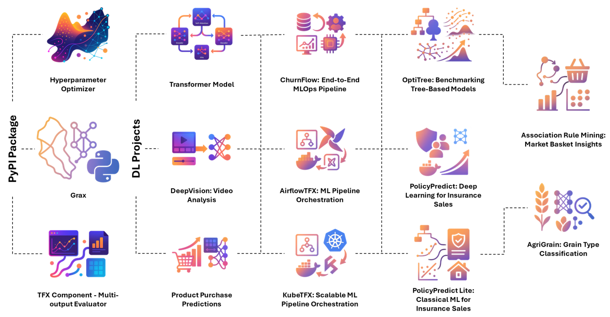

# 📂 Projects Portfolio

A curated collection of my machine learning and AI projects. Each project demonstrates real-world applications of data science, MLOps, and AI engineering.
 > ⚠️ Only non-confidential projects are included.

  

## 🗂️ Projects Overview
| Project                                                  | Description                                                                                                                                   | Tech Stack                                                                     | Links                                 |
| -------------------------------------------------------- | ----------------------------------------------------------------------------------------------------------------------------------------------- | ------------------------------------------------------------------------------ | ------------------------------------- |
| **Hyperparameter Optimizer (Python Package)**            | Python package for automated hyperparameter tuning using metaheuristic algorithms (Particle Swarms [PSO] & Pattern Search [PS]) with seamless scikit-learn integration. | `Python`, `scikit-learn`, `PSO`, `PS`                              | [🔗 Code](https://github.com/real-ahmed-moussa/hyperparameter_optimizer) |
| **TFX Component - Multi-output Evaluator (Python Package)**            | A lightweight and flexible TFX component for evaluating multi-output TensorFlow models. It computes per-output and global metrics and writes a TFMA-compatible JSON artifact for downstream analysis and reporting. | `Tensorflow`, `TFX`                              | [🔗 Code](https://github.com/real-ahmed-moussa/tfx-multioutput-evaluator) |
| **Grax (Python Package)**            | A lightweight Python library for transforming geospatial shapefiles into machine-learning-ready graph networks using NetworkX. | `fiona`, `numpy`, `shapely`                              | [🔗 Code](https://github.com/real-ahmed-moussa/grax) |
| **Transformer Model: Encoder–Decoder Architecture in PyTorch**      | Implementation of the Transformer architecture from scratch using PyTorch.   | `PyTorch`, `Lightning`                                   | [🔗 Code](https://github.com/real-ahmed-moussa/Projects-Portfolio/tree/main/Transformer%20Model%20-%20Encoder%E2%80%93Decoder%20Architecture%20in%20PyTorch)               |
| **DeepVision: Video Analysis**                           | ConvLSTM-based video classification model for automated video content analysis, improving real-time decision-making in video-heavy workflows.   | `TensorFlow`, `OpenCV`, `CNN`, `LSTM`                                          | [🔗 Code](https://github.com/real-ahmed-moussa/Projects-Portfolio/tree/main/DeepVision%20-%20Video%20Analysis)               |
| **Product Purchase Predictions: Machine Learning for Retail Demand**                           | A sequence-modeling pipeline that forecasts per-product daily purchases using a CNN+LSTM architecture over lagged and calendar features—built with PyTorch for scalable, multi-output regression.   | `pandas`, `numpy`, `scikit-learn`, `pytorch`, `matplotlib`                                          | [🔗 Code](https://github.com/real-ahmed-moussa/Projects-Portfolio/tree/main/Product%20Purchase%20Predictions%20-%20Machine%20Learning%20for%20Retail%20Demand)               |
| **ChurnFlow: End-to-End MLOps Pipeline**                 | Full MLOps pipeline for churn prediction with CI/CD automation, drift detection, and real-time FastAPI serving.                                 | `scikit-learn`, `MLflow`, `EvidentlyAI`, `FastAPI`, `Docker`, `GitHub Actions` | [🔗 Code](https://github.com/real-ahmed-moussa/Projects-Portfolio/tree/main/ChurnFlow%20-%20End-to-End%20MLOps%20Pipeline%20for%20Customer%20Retention)                |
| **AirflowTFX: ML Pipeline Orchestration**                | TFX pipeline orchestrated with Apache Airflow, enabling reproducible, modular ML workflows with Dockerized environments.                        | `TFX`, `Airflow`, `Docker`, `TFDV`, `TFT`, `TFMA`                              | [🔗 Code](https://github.com/real-ahmed-moussa/Projects-Portfolio/tree/main/AirflowTFX%20-%20Reproducible%20ML%20Pipeline%20Orchestration%20with%20TensorFlow%20Extended%20(TFX))               |
| **KubeTFX: Scalable ML Pipeline Orchestration**          | TFX pipeline deployed on Kubeflow Pipelines (Minikube), simulating scalable cloud-native ML operations.                                         | `TFX`, `Kubeflow`, `Kubernetes`, `Docker`                                      | [🔗 Code](https://github.com/real-ahmed-moussa/Projects-Portfolio/tree/main/KubeTFX%20-%20Scalable%20ML%20Pipeline%20Orchestration%20with%20TensorFlow%20Extended%20and%20Kubeflow)                  |
| **OptiTree: Benchmarking Tree-Based Models**             | Automated benchmarking of Decision Trees, Random Forest, XGBoost, CatBoost, and others using PSO optimization.                                  | `scikit-learn`, `LightGBM`, `XGBoost`, `CatBoost`, `MLflow`, `hyperparameter-optimizer`                    | [🔗 Code](https://github.com/real-ahmed-moussa/Projects-Portfolio/tree/main/OptiTree%20-%20Benchmarking%20Tree-Based%20Models%20with%20Metaheuristic%20Optimization)                 |
| **PolicyPredict: Deep Learning for Insurance Sales**     | Neural network solution to predict customer purchase likelihood for new insurance policies.                                                     | `TensorFlow`, `scikit-learn`, `pandas`, `NumPy`, `matplotlib`                  | [🔗 Code](https://github.com/real-ahmed-moussa/Projects-Portfolio/tree/main/PolicyPredict%20-%20Insurance%20Purchase%20Prediction%20with%20Deep%20Learning)            |
| **PolicyPredict Lite: Classical ML for Insurance Sales** | Logistic Regression, Random Forest, and SVM models for fast, interpretable predictions in insurance marketing.                                  | `scikit-learn`, `pandas`, `NumPy`                                              | [🔗 Code](https://github.com/real-ahmed-moussa/Projects-Portfolio/tree/main/PolicyPredict%20Lite%20-%20Insurance%20Purchase%20Modeling%20with%20Classical%20ML%20Algorithms)       |
| **Association Rule Mining: Market Basket Insights** | A retail analytics project applying association rule mining to uncover hidden product co-purchasing patterns, enabling smarter cross-selling, bundling, and promotion strategies.                                  | `scikit-learn`, `pandas`, `NumPy`, `mlxtend`                                              | [🔗 Code](https://github.com/real-ahmed-moussa/Projects-Portfolio/tree/main/Association%20Rule%20Mining%20-%20Market%20Basket%20Insights)       |
| **AgriGrain: Grain Type Classification**                 | Multiclass classification of grain types using ensemble methods and neural networks to automate agricultural quality control.                   | `R`, `pandas`, `NumPy`                                                         | [🔗 Code](https://github.com/real-ahmed-moussa/Projects-Portfolio/tree/main/AgriGrain%20-%20%20Multiclass%20Classification%20of%20Grain%20Types%20Using%20Ensemble%20and%20Neural%20Models)                |

## 📌 How to Use This Portfolio

 1. Browse individual project folders for:
      - **README.md** with overview, installation, usage, and results.
      - Source code, data (where allowed), and supporting files.
 2. Follow setup instructions in each project folder.
 3. Projects are ready to clone and run locally or in Dockerized environments (where specified).
