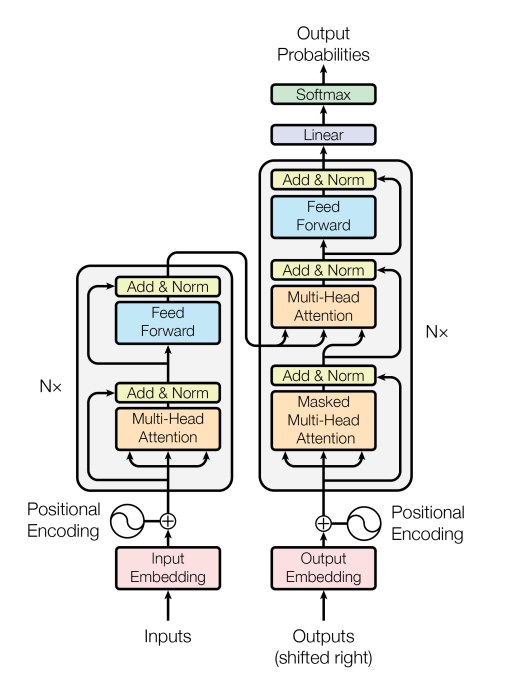

# 📌 Transformer Model: Encoder–Decoder Architecture in PyTorch
> Implementation of the Transformer architecture from scratch using PyTorch. This project demonstrates the key building blocks of Transformers—positional encoding, multi-head attention, encoder and decoder layers—without relying on high-level libraries like Hugging Face

## 📖 Overview
This project provides a clear, modular implementation of the Transformer model in PyTorch. It can serve as an **educational reference** for understanding sequence-to-sequence architectures, attention mechanisms, and model training workflows.

The notebook includes detailed class definitions for:
 - Positional Encoding
 - Multi-Head Attention
 - Feedforward Layers
 - Encoder & Decoder Blocks
 - Full Encoder–Decoder Transformer

## 🚀 Features
- ✅ **Pure PyTorch Implementation:** No reliance on pre-built Transformer classes.
- ✅ **Educational Design:** Each subcomponent (e.g., positional encoding, attention) is implemented and explained.
- ✅ **Customizable Architecture:** Adjust number of layers, heads, and embedding sizes.
- ✅ **Training Loop Ready:** Compatible with PyTorch DataLoader and optimizers (Adam).

## 🏢 Applications
This implementation can be used to:
- Build a translation model (e.g., English–Spanish).
- Experiment with sequence modeling tasks (summarization, text generation).
- Serve as a learning tool for students and practitioners studying Transformers.

## ⚙️ Tech Stack
| Technology   | Purpose                                                    |
| -----------  | ---------------------------------------------------------- |
| `PyTorch`    | Core implementation (attention, encoder/decoder, training) |
| `Lightning`  | Training orchestration (optional, via PyTorch Lightning)   |

## Original Transformer Architecture
Figure is from the original Attention Is All You Need paper (see references).

## 📂 Project Structure
<pre>
📦 Transformer Model
 ┣ 📜 Transformer_Model.ipynb          # Jupyter Notebook with full implementation
 ┣ 📜 Original_Transformer_Arch.png
 ┗ README.md               
</pre>

## 🛠️ Installation
1️⃣ **Clone the Repository**
<pre>
git clone https://github.com/ahmedmoussa/Projects-Portfolio.git
cd 'Transformer_Model'
</pre>

2️⃣ **Install Dependencies**
<pre>
pip install torch lightning
</pre>

3️⃣ **Open Notebook**
<pre>
jupyter notebook Transformer_Model.ipynb
</pre>

## 📊 Results
- **Multi-Head Attention** successfully captures token-level dependencies across sequences.
- **Encoder–Decoder stacking** allows contextual learning and sequence generation.
- Model achieves **stable training** using Adam optimizer and LayerNorm.
> ⚡ For demonstration purposes, toy datasets (e.g., random sequences) can be used. Real NLP tasks (translation, summarization) can be plugged in with minimal modifications.

## References
Vaswani, A., Shazeer, N., Parmar, N., Uszkoreit, J., Jones, L., Gomez, A. N., Kaiser, Ł., & Polosukhin, I. (2017). Attention Is All You Need. Advances in Neural Information Processing Systems (NeurIPS).

## 📝 License
This project is shared for portfolio purposes only and may not be used for commercial purposes without permission.